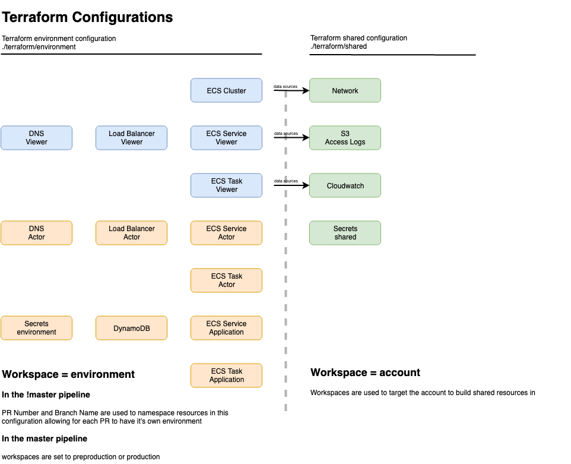
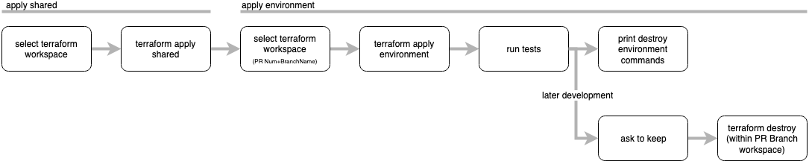

# 7. Split Terraform Configuration

Date: 2019-04-11

## Status

Accepted

## Context

Engineers in the team want to have their code changes built as real environments in the Development AWS account so that they can have their work evaluated.

Evaluation includes automated and user acceptance testing.

When evaluation is finished it should be possible to destroy the environment, while retaining important artifacts and data (logs for example).

It will be possible to host multiple PR environments in the Development AWS account

## Decision

### Terraform Configuration

We will identify and manage separately, resources at an Account level and resources at an Environment level.

Account level resources, such as S3 buckets for logs, the default VPC and networking will be used Environment level resources, such as ECS clusters, DNS routes and Load Balancers.

This will enable us to use Terraform Workspaces to contain an Environment completely for it to be built and destroyed simply.

Account level resources will remain in place after an Environment is destroyed.

### Name Spacing
We will use the github PR number and the first few characters of the branch name to namespace the environment and it's resources

For example, DNS records will be created for each environment using the namespace `https://view.025-UML-93.use-an-lpa.opg.service.justice.gov.uk`

while an ECS cluster will be named `025-UML-93-use-an-lpa`

### Environment lifecycle
An Environment will be built when a PR is opened
Once evaluation is complete, the Envirnoment can be destroyed.

To begin with the pipeline will print instructions for destroying an Environment.

Later, destroying an Environment will be automated and scheduled with a maximum life span of a day or two.

### CI/CD Pipeline
The Terraform steps in the pipeline will always first provision the Account level shared resources, then provision the Environment level resources.

## Consequences

New Account level resources required by Environments must be created in the terraform_shared configuration, then used in the terraform_environment configuration as data sources.

This will lead to some duplication, and sometimes additional complexity.

The split configuration will allow us to 
- reuse resources such as the default VPC, and resources that are costly
- persist logs outside of environment lifecycles
- enable developers to work side by side on applications changes, with consistent and automated tests.