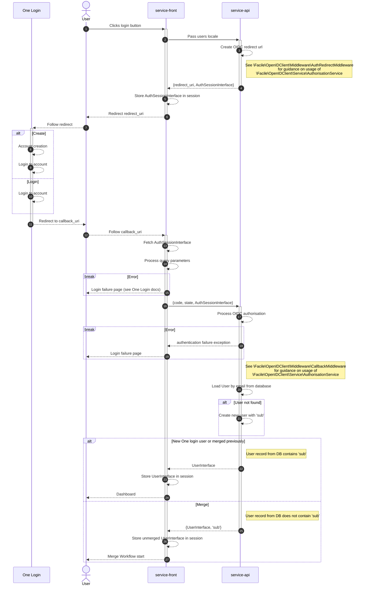

# 22. Choice of library to interface with Gov.uk One Login

Date: 2023-09-12

## Status

Accepted

## Context

In order to implement the Gov.uk One Login OIDC login service we should ideally select a well-supported opensource
library to provide the main implementation details. The OIDC Authorisation flow is a tricky thing to get right and
needs to be cryptographically secure in its implementation.

Our needs are complicated by the split frontend/api architecture that we have due to the fact that most libraries make
the assumption that they have full control and access of PHP http semantics and tooling (access to cookies, sessions,
raw http header values etc).

The library [`facile-it/php-openid-client`](https://github.com/facile-it/php-openid-client) provides a solid and well tested implementation of the hard parts of the
problem space and a set of optionally usable middleware (that we can adapt or otherwise ignore).

## Decision

We shall use [`facile-it/php-openid-client`](https://github.com/facile-it/php-openid-client) as our OIDC library of choice. Below is a sequence diagram of the roughly
intended flow this library allows.

## Consequences

We'll be tied to the chosen library and its updates (or lack thereof), though this can be somewhat mitigated with some
sensible usage of interfaces. Additionally the project is MIT licensed so major issues can be solved with a simple fork
of the codebase.
