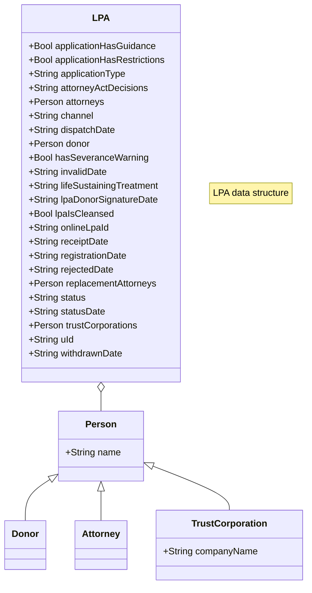

# 23.  Legacy versus Modernise data formats and proposed new data format

Date: 2024-06-11

## Status

Accepted

## Context

Use an LPA now needs to support both Legacy LPAs from Sirius and Modernise LPAs from the Data Store. We need to reconcile the two and have a data format that can support both.

The difference between legacy and Modernise data formats are as follows: 

Top level Sections
-------------------
* There is a donor section for both Legacy and Modernise
* Legacy has attorneys and replacementAttorneys lists,  Modernise has status field for Attorney of which "replacement" is a possible value, we can load Modernise's attorneys marked in this way, into our replacementAttoryneys section
* There is TrustCorporations for both
* Modernise has a schema version number which could in future be used to do different logic with fields if they are different in a later version

People e:g Donor, Attorneys including Replacement Attorneys  (Use doesn't need to know about Certificate Provider or People to Notify)
------------------------------------------------------------

Same in each
------------
* email
* country   (within address block)
* postcode

New fields for Modernise (all persons) not in Legacy
-------------------------------------------------------
* town -  we will put this in AddressLine3 where needed
* channel - Use doesn't need this at person level, only at top level

New fields for Modernise not used in Use An LPA
--------------------------------------------------
* contactLanguagePreference - we will ignore because instead we use the Use account's preferences
* identityCheck - not used by Use
* phone - (only Attorney ) not used by Use

Present in Legacy but Missing in Modernise
-----------------------------------------------
* county -  Modernise just uses lines (1-3) instead 
* address -> type "Primary" doesn't apply, in fact all Legacy addresses are primary
* companyName (wthin the person block) now appears to be "name"  within Trust Corporation block

Renamed fields
-----------------
* Legacy OtherNames field equivalent to Modernise otherNamesKnownBy
* Legacy surnName field equivalent to Modernise lastName
* Legacy dob equivalent to Mdoernise dateOfBirth - format the same (YYYY-MM-DD)
* Legacy addressLineN becomes lineN in Modernise (within address block)
* "applicationHasRestrictions": true, and "applicationHasGuidance": false, in Modernise are covered by hasRestrictionsAndConditions
* systemStatus  - boolean whether person is active or not - is replaced in Modernise by status field on attorneys 
* lpaDonorSignatureDate equivalent to signedAt in Modernise

Other differences
----------------
* Legacy allowes multiple addresses.  But multiples not used in practice, so can just use 1st one for Legacy, use the only one for Modernise
* Legacy has firstName and middleName,  vs Modernise has these merged into 1 as firstNames. We will need to support both formats, as legacy requires name to be split but for Modernise is not straightfoward or desirable to attempt to split the multi-name string they send us

Trust Corporations
----------------------
Same changes as for People above. Additionally, companyName is renamed name in Modernise. Modernise appears not to have companyNumber, but we don't use that in Use

Other fields (top level in json):
-------------------------
* uid same but has M on the front, for Modernise
* Legacy "applicationType": "Classic", doesn't have Modernise equivalent but should not be needed
status is at present, the same but within properties block in Modernise,  capital Registered or Processing in legacy, lowercase enum registered or processing in Modernise. This is not yet signed off and may change in Modernise and take the form cannot-register rather than Cannot Register
statusDate only exists in Legacy, should be able to manage without this for Use?
* legacy lpaDonorSignatureDate (YYYY-MM-DD) appears to be replaced with signedAt (2024-01-10T23:00:00Z) for Modernise , IS needed for Use an LPA
* channel (top-level) - may be needed in future by Use to deduce whether IaP is image or text

Renamed fields
-----------------
*  attorneyActDecisions is renamed whenTheLpaCanBeUsed
* "caseAttorneyJointly": true, "caseAttorneyJointlyAndJointlyAndSeverally": false, "caseAttorneyJointlyAndSeverally": false, "caseAttorneySingular": false, are replaced by 1 enum - "howAttorneysMakeDecisions": "jointly"   . We will replace the current 4 fields internally, with a new enum similar to how Modernise does it, because this is a better less clumsy way to handle this data
* "caseSubtype": "hw", is replaced by "lpaType": "personal-welfare"  , "pfa" is replaced by "property-and-affairs"
*  "lifeSustainingTreatment": "Option B", renamed to e:g "lifeSustainingTreatmentOption": "option-a"  - make this an enum internally
*  withdrawnDate renamed withdrawnAt
* "registrationDate": "2024-06-04", renamed registrationAt

new fields in Modernise
-------------------------
"certificateProviderNotRelatedConfirmedAt" -  Not needed for Use

Present in Legacy but Missing in Modernise
----------------------------------------------
* "hasSeveranceWarning": false,   This is yet to be built in Modernise but will appear in notes field. Use will need to show the contents of this field rather than just a standard warning as done for legacy
*  "receiptDate": "2014-09-26", no Modernise equivalent but unlikely to be needed by Use an LPA
* "dispatchDate": "2021-10-14", no Modernise equivalent but unlikely to be needed by Use an LPA
* "invalidDate": "2024-06-04", no Modernise equivalent but unlikely to be needed by Use an LPA
* "rejectedDate": null, no Modernise equivalent but unlikely to be needed by Use an LPA
* "lpaIsCleansed": false,  Does not Apply to Modernise
* Legacy "cancellationDate": "2020-03-17", appears not to have an equiv in Modernise - we would will use registrationStatus to identify if a Modernise LPA is cancelled
* "onlineLpaId": "A15527329531"  not needed in Use as we use uid

It looks as though Modernise may at some point support jointlyAndSeverally for some Attorneys only and not others, but this is yet to be confirmed. 

## Decision
Changes to the data structure will consist of (a) New fields and (b) Existing fields populated from differently named ones

(a) New fields at the top level
----------------------
* channel - populated by channel from Modernise

(b) Existing fields from differently named one, at the top level
-------------------------------------------------------
*  attorneyActDecisions will be populated by whenTheLpaCanBeUsed for Modernise LPAs
* "caseAttorneyJointly": true, "caseAttorneyJointlyAndJointlyAndSeverally": false, "caseAttorneyJointlyAndSeverally": false, "caseAttorneySingular": false, are replaced by 1 enum - "howAttorneysMakeDecisions": "jointly"   . We will replace the current 4 fields internally, with a new enum similar to how Modernise does it, because this is a better less clumsy way to handle this data
* "caseSubtype": "hw", is replaced by "lpaType": "personal-welfare"  , "pfa" is replaced by "property-and-affairs"
*  "lifeSustainingTreatmentwill be populated by ": "Option B", renamed to e:g "lifeSustainingTreatmentOption": "option-a"  - make this an enum internally for Modernise LPAs
*  withdrawnDate will be populated by withdrawnAt for Modernise LPAs
* registrationDate will be populated by registrationAt for Modernise LPAs

(a) New fields at the Person level
--------------------------------------
* new firstNames field is populated by firstNames for Modernise LPAs

(b) Existing fields from differently named ones, at the Persons level
-------------------------------------------------------
* OtherNames will be populated by otherNamesKnownBy for Modernise LPAs
* surName will be populated by lastName for Modernise LPAs
* dob will be populated by dateOfBirth for Modernise LPAs
* addressLineN will be populated by lineN within address block for Modernise LPAs
* companyName will be populated by name for Modernise LPAs  (for Trust Corporations only)
* applicationHasRestrictions": true, and "applicationHasGuidance": false, in Modernise are covered by hasRestrictionsAndConditions for Modernise LPAs
* boolean whether person is active or not - is replaced in Modernise by status field on attorneys 
* firstName and middleName continue to be populated from legacy
* town -  will be popluated from AddressLine3 where needed
* lpaDonorSignatureDate will be populated from signedAt  

## Consequences
Fields have not been renamed to match Modernise fields. We may wish to do this in time when Modernise becomes the default 
